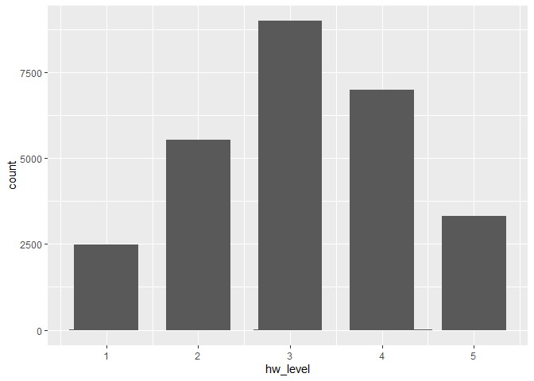

data
================
NACC

## by analysis

    ## Warning: package 'plotly' was built under R version 4.0.3

<!-- -->

## BU physics department professor average

<!-- -->

## Including Plots

You can also embed plots, for example:

Note that the `echo = FALSE` parameter was added to the code chunk to
prevent printing of the R code that generated the plot.
